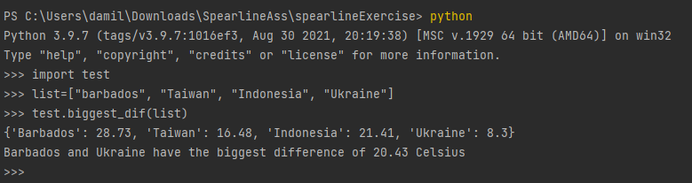

# spearlineExercise
This is my submission for the Spearline Python Assessment using OpenWeatherAPI

## Running the code
* Open a terminal with path to where the code is saved
* Run command `python` to open the python CLI
* Import the test.py code into the CLI by running `import test`
* Initialise and declare a list of countries you want to get the biggest difference of. It would look something like:
> `list=[<country1>, <country2>, ...]`
* Run the biggest difference of the list using the function `test.biggest_dif(list)` where `list` is your initialised/declared list of countries

